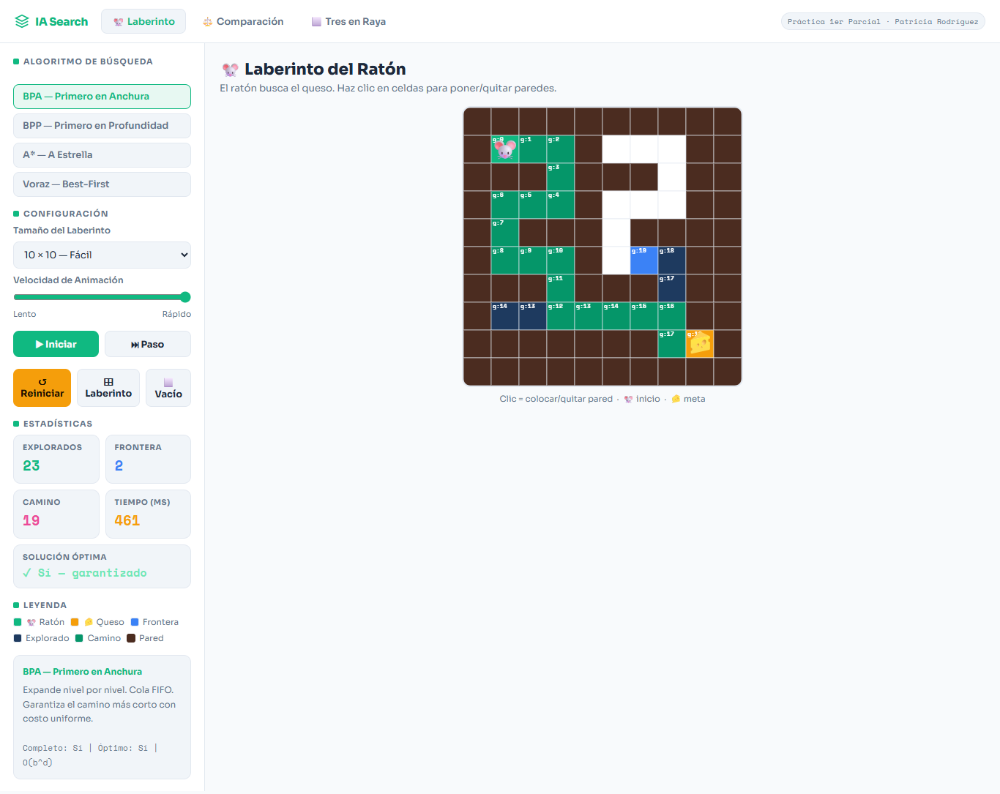
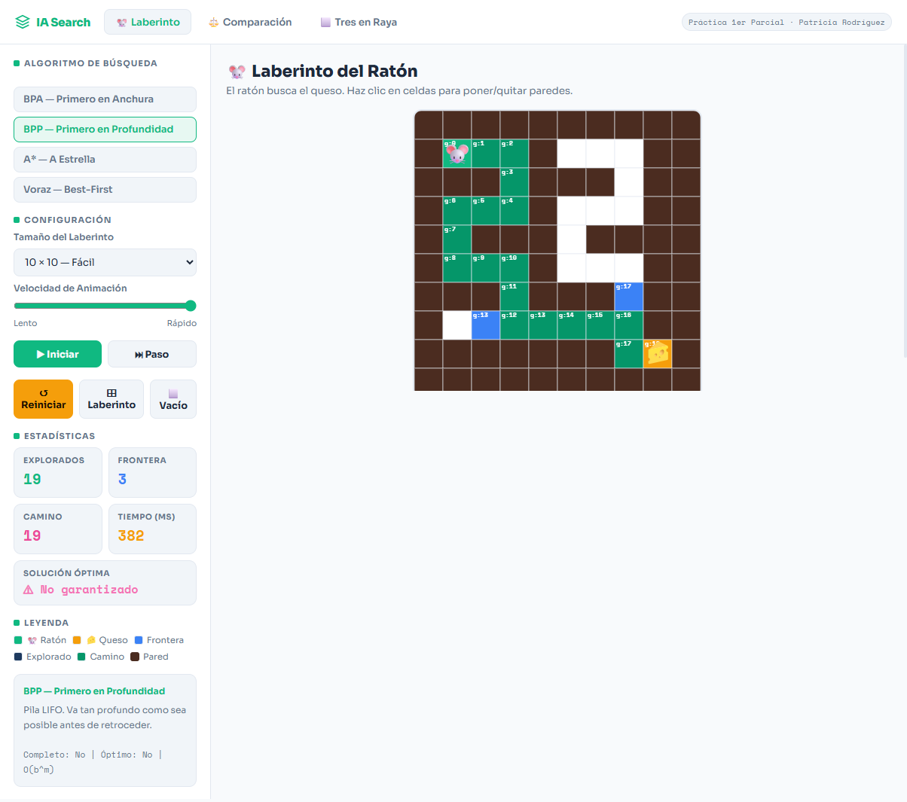
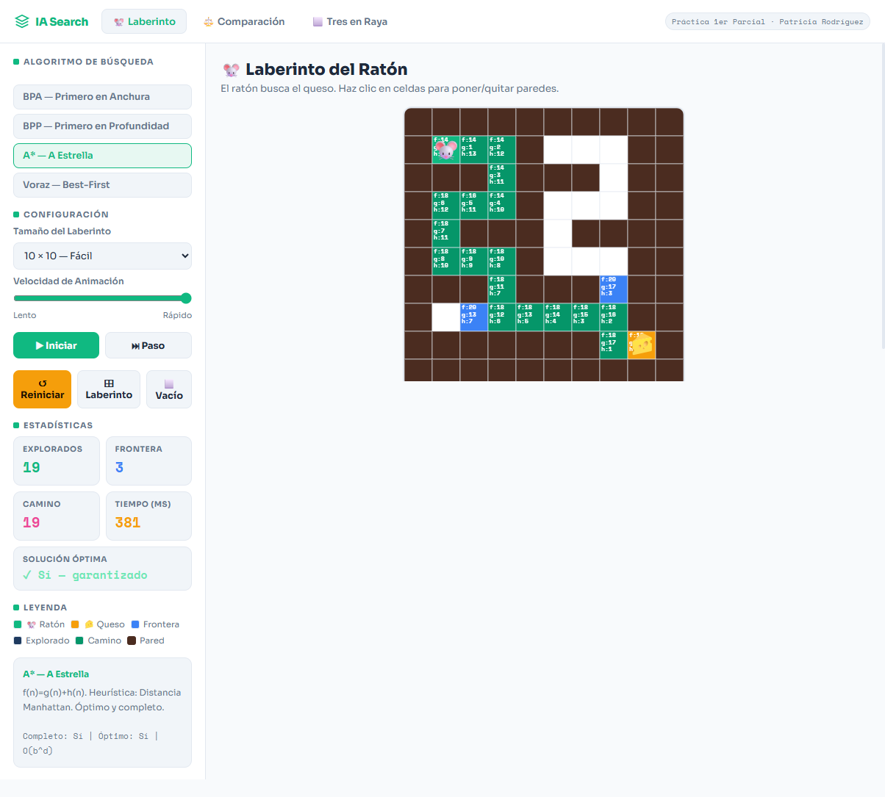
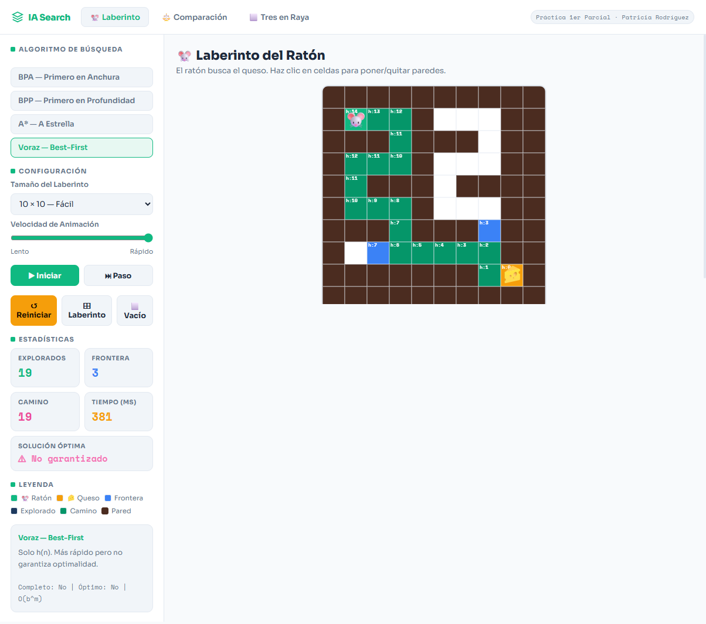
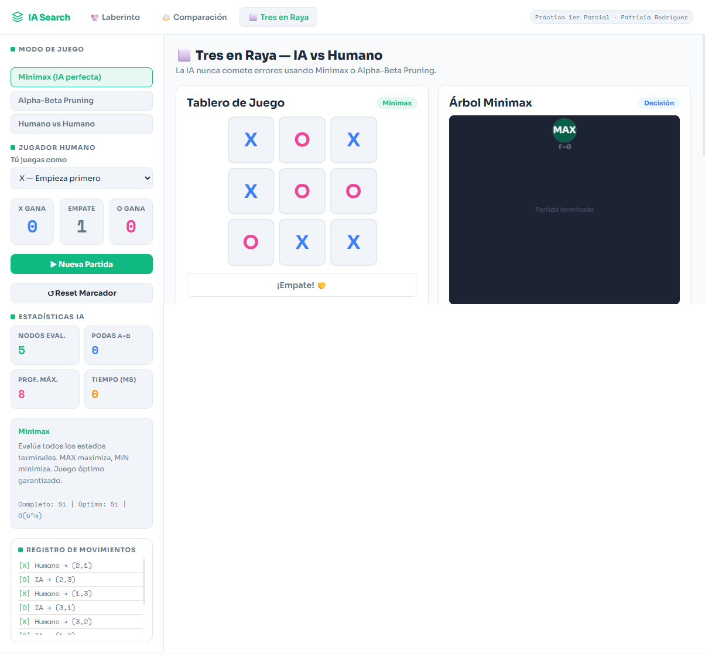
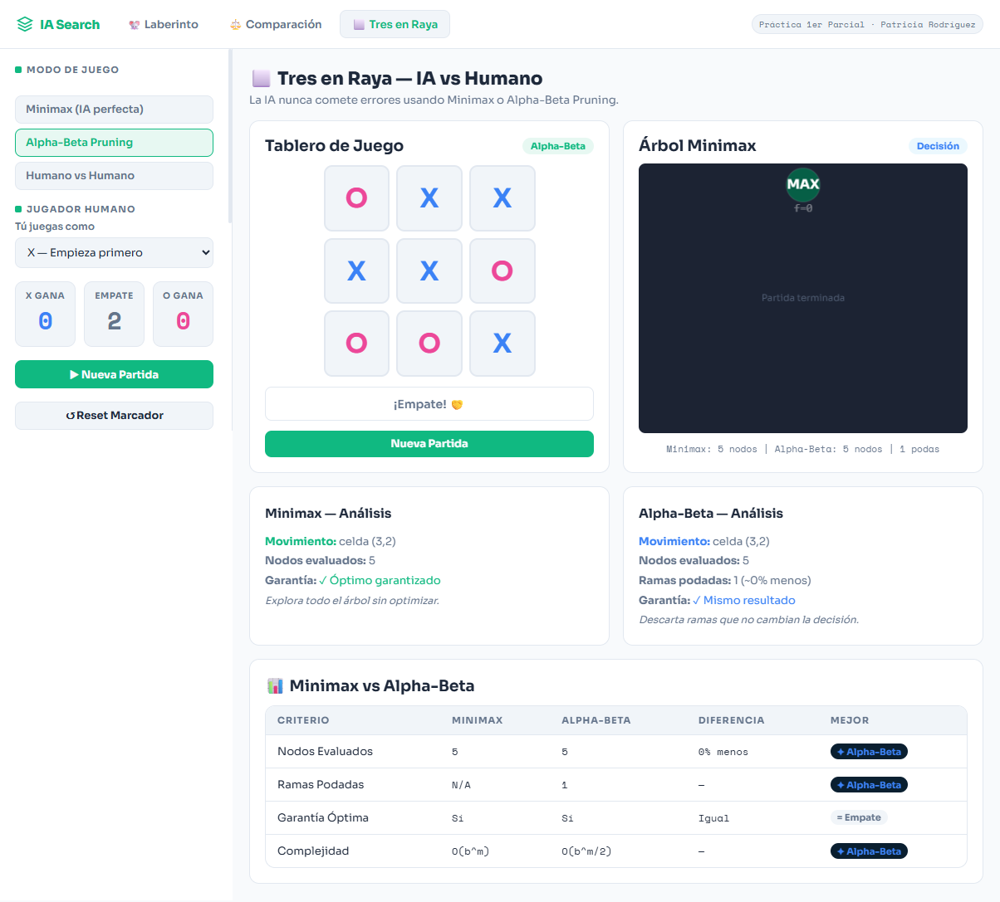

Readme · MDCopiar🤖 IA Search — Práctica Primer Parcial

Visualizador interactivo de algoritmos de búsqueda en Inteligencia Artificial
Implementa dos problemas clásicos con animación paso a paso, comparación de métricas y diseño responsive.

Problema 1: LABERINTO (Ratón en Laberinto)
Mostrar imagen de prueba : Primero en Anchura

Mostrar imagen de prueba : Primero en Profundidad

Mostrar imagen de prueba : A Estrella

Mostrar imagen de prueba : Voraz (Best-First)

PROBLEMA 2: TRES EN RAYA(Tic-Tac-Toe)
Mostrar imagen de prueba : Minimax

Mostrar imagen de prueba : Alpha-Beta Pruning

🌐 Demo en Línea
Ver el proyecto funcionando sin instalación:
🔗 https://ia-search-practice.vercel.app/

Puedes explorar todos los algoritmos directamente desde el navegador, sin instalar nada.

📋 Problemas Implementados
GrupoProblemaAlgoritmosGrupo 1🐭 Ratón en LaberintoBPA, BPP, A*, Voraz (Best-First)Grupo 2⬜ Tres en Raya (Tic-Tac-Toe)Minimax, Alpha-Beta Pruning
Funcionalidades por sección
🐭 Tab Laberinto

Selección entre 4 algoritmos de búsqueda
Tamaño de laberinto configurable: 10×10, 15×15, 20×20, 25×25
Generación automática de laberintos (Recursive Backtracker)
Animación paso a paso o continua con control de velocidad
Clic en celdas para colocar/quitar paredes
Estadísticas en tiempo real: nodos explorados, frontera, longitud del camino, tiempo

⚖️ Tab Comparación

A* vs BPA ejecutados simultáneamente en el mismo laberinto
Canvases lado a lado con animación sincronizada
Tabla de resultados con ganador destacado por métrica

⬜ Tab Tres en Raya

IA invencible con Minimax o Alpha-Beta Pruning seleccionable
Visualización del árbol de decisión Minimax en tiempo real
Panel de análisis comparativo de nodos evaluados vs podas
Marcador de partidas y registro de movimientos

🚀 Instalación y Ejecución Local
Requisitos Previos
Este proyecto no requiere Node.js ni npm. Solo necesitas:

Un navegador moderno (Chrome, Firefox, Edge, Safari)
La extensión Live Server para VS Code

¿Por qué no necesita npm? El proyecto usa JavaScript ES Modules nativos del navegador.
No hay proceso de compilación ni dependencias que instalar.

Pasos de instalación
1. Descomprimir el proyecto
Descomprime el archivo  Practica PP IA.zip  en la ubicación deseada
2. Abrir en VS Code
Abre VS Code
→ File → Open Folder
→ Selecciona la carpeta  Practica PP IA
3. Instalar la extensión Live Server (solo la primera vez)
En VS Code:
→ Extensions (Ctrl+Shift+X)
→ Buscar: "Live Server"
→ Autor: Ritwick Dey
→ Instalar
4. Ejecutar el proyecto
Clic derecho en  index.html
→ Open with Live Server
5. Ver en el navegador
El navegador se abrirá automáticamente en:
http://127.0.0.1:5500
¡Listo! La aplicación está funcionando. 🎉
Detener el servidor
En VS Code → barra inferior → clic en "Port: 5500"

🗂️ Estructura del Proyecto
Practica PP IA/
│
├── index.html                  ← Punto de entrada: estructura HTML completa de la UI
│
├── styles/
│   └── globals.css             ← Estilos globales, variables CSS y media queries responsive
│
├── src/
│   ├── app.js                  ← Lógica principal: navegación, maze, comparación y TTT
│   │
│   └── utils/
│       ├── mazeAlgorithms.js   ← BPA, BPP, A*, Voraz — módulo puro sin acceso al DOM
│       └── tttAlgorithms.js    ← Minimax, Alpha-Beta, checkWinner — módulo puro
│
├── public/
│   └── favicon.svg             ← Ícono de la aplicación
│
└── README.md                   ← Este archivo
Principio de separación de responsabilidades:

mazeAlgorithms.js y tttAlgorithms.js son funciones puras — no tocan el DOM, solo reciben datos y retornan resultados. Esto los hace independientes, testeables y reutilizables.
app.js maneja toda la interacción con el DOM, el canvas y los eventos de usuario.
globals.css centraliza todos los estilos con variables CSS para consistencia visual.

🛠️ Tecnologías Utilizadas
TecnologíaVersión / TipoUsoHTML5Estándar W3CEstructura de la interfaz y páginasCSS3Estándar W3CEstilos, animaciones y diseño responsiveJavaScript ES ModulesES2020+Algoritmos, lógica de app y CanvasHTML5 Canvas APIAPI del navegadorRenderizado del laberinto y árbol MinimaxGoogle FontsCDNTipografías: Sora + Space MonoLive ServerExtensión VS CodeServidor local para ES Modules

🧮 Algoritmos Implementados
Grupo 1 — Laberinto
AlgoritmoCompletoÓptimoFronteraHeurísticaBPA — AnchuraSíSí (costo uniforme)Cola FIFONo usaBPP — ProfundidadNoNoPila LIFONo usaA* — A EstrellaSíSí (h admisible)Min-heap f(n)=g+hManhattanVoraz — Best-FirstNoNoMin-heap h(n)Manhattan

Heurística A*: Distancia Manhattan h(n) = |Δfila| + |Δcolumna|

Grupo 2 — Tres en Raya
AlgoritmoCompletoÓptimoNodos (tablero vacío)MinimaxSíSíHasta ~350,000Alpha-BetaSíSí (mismo resultado)~40–60% menos

📱 Compatibilidad Responsive
La aplicación está optimizada para todos los dispositivos:
DispositivoAnchoComportamientoMóvil pequeño< 480pxTablero compacto, stats en 2 columnasMóvil< 768pxSidebar con botón ⚙ Controles, menú hamburguesaTablet768px – 1024pxSidebar lateral 250px, layouts en 2 columnasDesktop> 1024pxSidebar 285px, layouts completas

🔧 Solución de Problemas Comunes
La página no carga o aparece en blanco
Causa: Los ES Modules no funcionan abriendo el archivo directamente (file://).
Solución: Asegúrate de usar Live Server y no abrir index.html directamente con doble clic.
✗  file:///C:/Users/.../index.html   ← NO funciona
✓  http://127.0.0.1:5500             ← SÍ funciona (Live Server)
Error en la consola: "Cannot use import statement"
Causa: El archivo se está sirviendo sin un servidor HTTP.
Solución: Usa Live Server como se indica en los pasos de instalación.
Las fuentes no cargan (texto se ve diferente)
Causa: Sin conexión a internet, Google Fonts no está disponible.
Solución: Conectarse a internet o el proyecto sigue funcionando con fuentes del sistema.
El laberinto no se ve o el canvas está vacío
Causa: La ventana puede ser demasiado pequeña al cargar.
Solución: Redimensiona la ventana o recarga la página (F5).
La IA del Tres en Raya no responde
Causa: Puede haber un error de JavaScript en la consola.
Solución: Abre DevTools (F12) → pestaña Console → reporta el error si aparece.

👥 Integrantes del Grupo
(Agregar nombres aquí)

📚 Bibliografía

Russell, S. & Norvig, P. (2004). Inteligencia Artificial: Un Enfoque Moderno (2ª ed.). Pearson. Cap. 3 y 4.
Hart, P. E., Nilsson, N. J., & Raphael, B. (1968). A formal basis for the heuristic determination of minimum cost paths. IEEE Transactions on Systems Science, 4(2).
Knuth, D. E., & Moore, R. W. (1975). An analysis of alpha-beta pruning. Artificial Intelligence, 6(4).

Docente: Lic. Patricia Rodríguez Bilbao
Materia: Inteligencia Artificial — Primer Parcial
